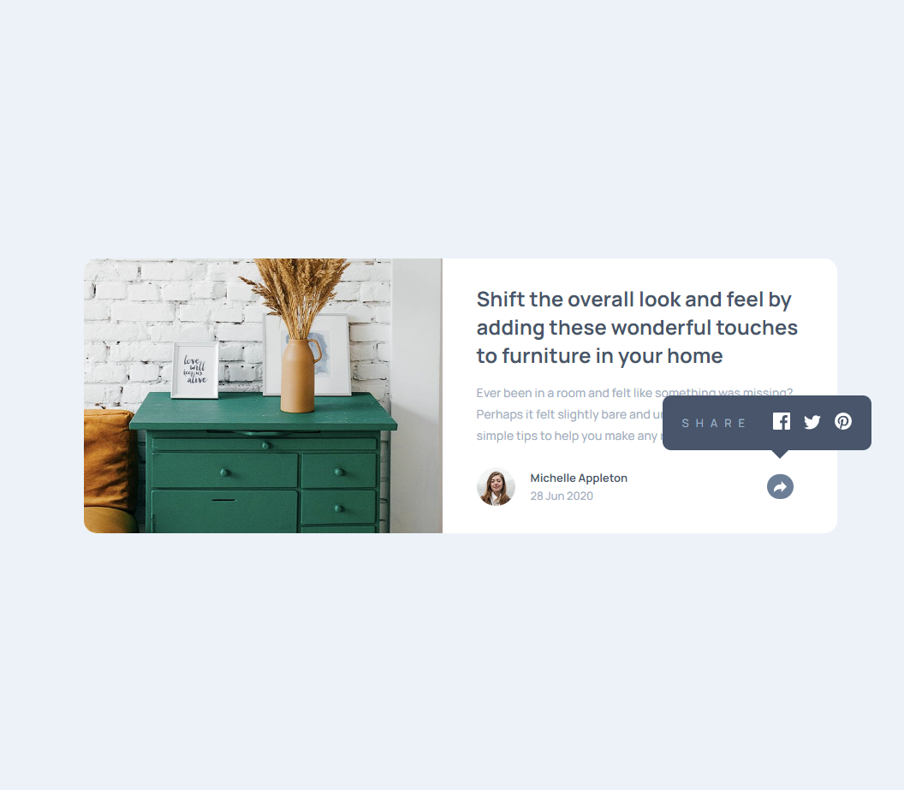
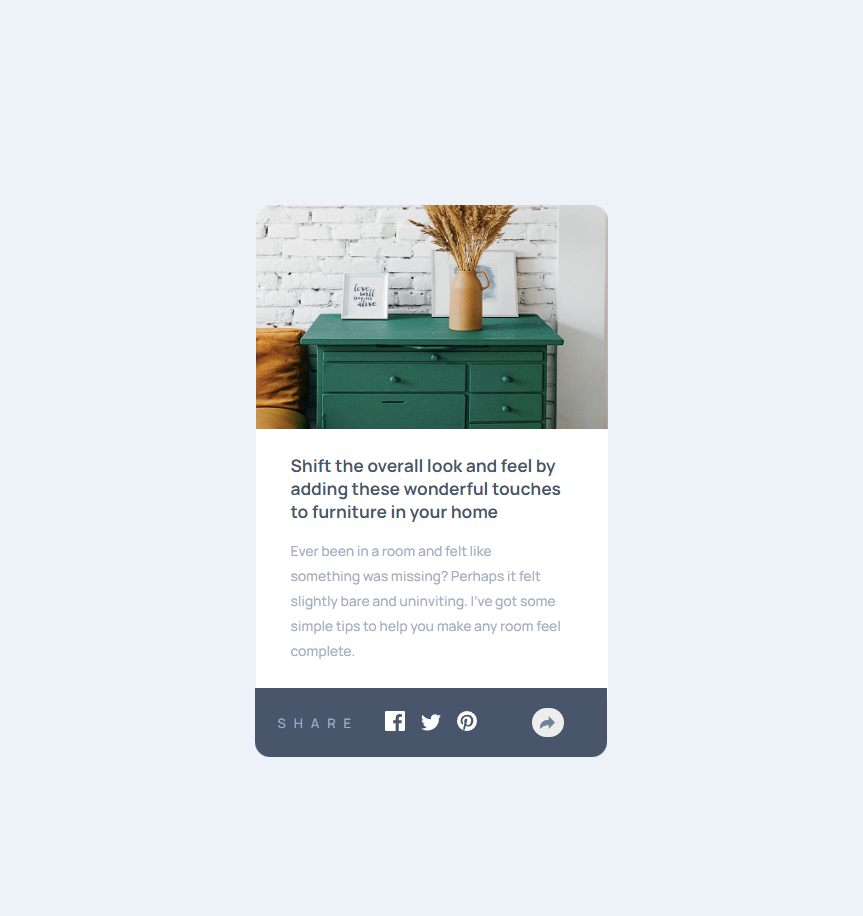

# Frontend Mentor - Article preview component solution

This is a solution to the [Article preview component challenge on Frontend Mentor](https://www.frontendmentor.io/challenges/article-preview-component-dYBN_pYFT). Frontend Mentor challenges help you improve your coding skills by building realistic projects.

## Table of contents

- [Overview](#overview)
  - [The challenge](#the-challenge)
  - [Screenshot](#screenshot)
  - [Links](#links)
- [My process](#my-process)
  - [Built with](#built-with)
  - [What I learned](#what-i-learned)
- [Author](#author)

## Overview

### The challenge

Users should be able to:

- View the optimal layout for the component depending on their device's screen size
- See the social media share links when they click the share icon

### Screenshot




### Links

- [Solution URL](https://github.com/TrEv0rRrRr/article-preview-component-master)
- [Live Site URL](https://trev0rrrrr.github.io/article-preview-component-master/)

## My process

### Built with

- Semantic HTML5 markup
- CSS custom properties
- Flexbox
- CSS Grid
- Mobile-first workflow

### What I learned

```css
@media screen and (min-width: 894px) {
  main {
    padding: 20px 40px;
  }

  h1 {
    font-size: 1.5rem;
  }

  .div__p-text {
    font-size: 0.88rem;
  }

  .button__share-img {
    margin-left: 145px;
    position: relative;
  }

  .div__div-social-media {
    position: absolute;
    width: 53%;
    top: 160px;
    left: 257px;
    border-radius: 10px;
    display: flex;
    justify-content: space-between;
  }

  .div__div-social-media .button__share-img {
    display: none;
  }

  .div__div-social-media::before {
    content: "";
    position: absolute;
    border-left: 15px solid transparent;
    border-right: 15px solid transparent;
    border-top: 15px solid var(--Very-Dark-Grayish-Blue);
    top: 59px;
    left: 50%;
  }
}
```

```js
const divShare = document.querySelector(".div__div-button-share");
const shareButtonDesk = document.querySelector(".desk");
const shareButtonMob = document.querySelector(".mob");
const divProfile = document.querySelector(".div__profile");

let wWLimit = 894;

shareButtonDesk.addEventListener("click", () => {
  const windowWidth = window.innerWidth;
  if (windowWidth >= wWLimit) {
    divShare.classList.toggle("hidden");
    divProfile.classList.replace("hidden", "active");
  } else {
    divShare.classList.toggle("active");
    divProfile.classList.replace("active", "hidden");
  }
});

shareButtonMob.addEventListener("click", () => {
  const windowWidth = window.innerWidth;
  if (windowWidth < wWLimit) {
    divShare.classList.toggle("active");
    divProfile.classList.toggle("active");
  } else {
    divShare.classList.toggle("hidden");
    divProfile.classList.replace("hidden", "active");
  }
});
```

## Author

- Frontend Mentor - [@yourusername](https://www.frontendmentor.io/profile/yourusername)
